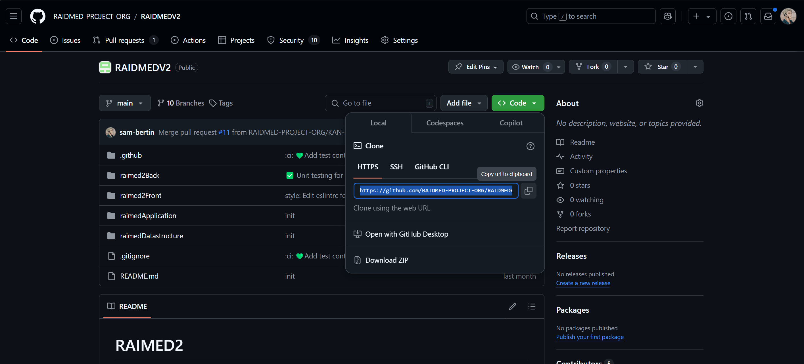
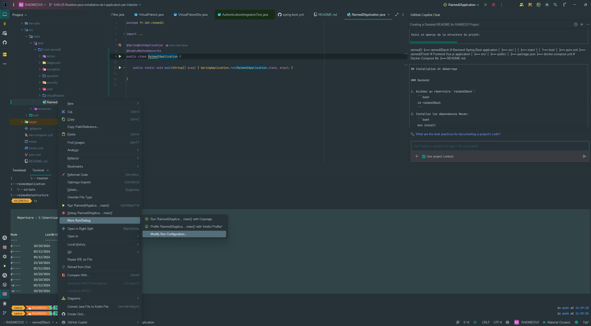
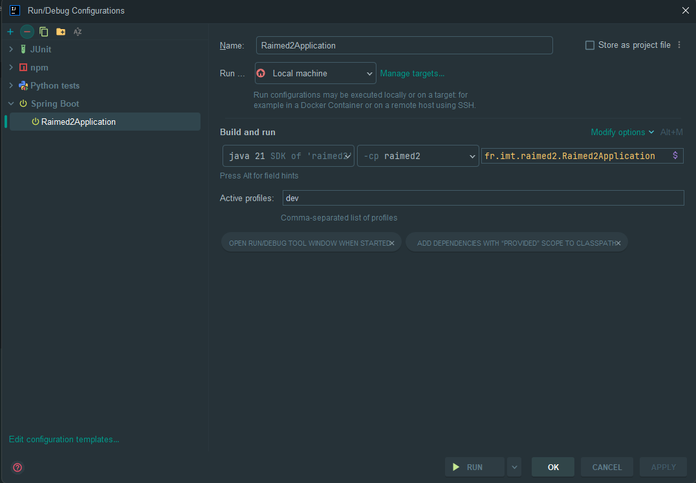

# RAIMED2
## Application de Diagnostic Virtuel pour les Étudiants en Médecine

Ce Proof of Concept (POC) représente une application novatrice conçue par un professeur de médecine, destinée à faciliter les diagnostics virtuels avec des patients. L'objectif principal de cette application est d'aider les étudiants en médecine à développer leurs compétences de réflexion dans le processus diagnostique.

## Table des matières
- [Structure du projet](#structure-du-projet)
- [Documentation](#documentation)
- [Récupérer le code](#récupérer-le-code)
- [Requirements](#requirements)
- [Installation et démarrage](#installation-et-démarrage)
- [Utilisation de l'application](#utilisation-de-lapplication)

## Structure du projet

Voici un aperçu de la structure du projet:

```plaintext
raimed2/
├── .github/                 # GitHub Actions workflows
├── docs/                    # Documentation files
├── raimed2Backend/          # Backend source code
├── raimed2Frontend/         # Frontend source code
├── raimedApplication/       # Application files
├── raimedDatastructure/     # Schéma de données de l'application
├── .gitignore               # Git ignore file
├── README.md                # Project README file
```

## Documentation

### [Développeur] Datastructure

À des fins d'abstraction de la donnée, nous avons créé un fichier XSD définissant la donnée sous format XML (Nous avons aussi mis un exemple de fichier XML possible). Certains outils permettent de recevoir ce type XSD et de créer des formulaires. Cela pourrait éviter de coder une partie de l'application et de permettre une généralisation du type PatientVirtuel à une multitude d'applications.

## Récupérer le code

Pour récupérer le code source depuis GitHub, suivez les étapes ci-dessous:

1. Téléchargez et installez [Git](https://git-scm.com/downloads).
1. Ouvrez votre terminal.
2. Clonez le dépôt en utilisant la commande suivante:

    ```bash
    git clone https://github.com/votre-utilisateur/raimed2.git
    ```
    Remplacez `votre-utilisateur` par votre nom d'utilisateur GitHub ou récuperer le lien depuis le répertoire du projet (https://github.com/RAIDMED-PROJECT-ORG/RAIDMEDV2).

   

4. Accédez au répertoire du projet:

    ```bash
    cd RAIDMEDV2
    ```
## Requirements

Avant de commencer, assurez-vous d'avoir les éléments suivants installés sur votre machine:

- [IntelliJ IDEA Community Edition](https://www.jetbrains.com/idea/download/)
- [Java JDK 21](https://www.oracle.com/java/technologies/javase-jdk21-downloads.html)
- [Maven](https://maven.apache.org/install.html)
- [Node.js 20 et npm](https://nodejs.org/) 
- [Docker](https://www.docker.com/get-started)

## Installation et démarrage

### Editeur de code

1. Ouvrez le projet dans IntelliJ IDEA.
2. Installez les plugins recommandés. (maven, lombok, vue.js, ...)
3. Configurez le projet pour utiliser Java 21.
4. Configurez le projet pour utiliser Maven.

Un certain nombre d'options sont généralement proposés au démarrage de l'application via des pop ups.
Pour acceder à la liste des plugins dans IntelliJ IDEA, allez dans `File > Settings > Plugins`.

#### Configuration dev

Configurer votre éditeur pour lancer l'application en mode dev.



Le fichier Raimed2Application.java doit être à cet emplacement `src/main/java/fr/imt/raimed2/Raimed2Application.java`



### Docker

L'application utilise Docker afin de gerer la base de données.
Docker a donc besoin d'être démarré pour que l'application puisse fonctionner.
Pensez à le démarrer en démarrant l'application Docker Desktop par exemple.

Configurer le fichier `application-dev.properties` dans le dossier `raimed2Back/src/main/resources` pour qu'il corresponde à la configuration de la base de données.

```properties
spring.docker.compose.file=<chemin-vers-votre-dossier>/dev-compose.yml
```

Cela indique à l'application back end d'utiliser le fichier `dev-compose.yml` au démarrage de l'application en configuration de dev.

### Backend

1. Accédez au répertoire `raimed2Back`:
    ```bash
    cd raimed2Back
    ```
2. Installez les dépendances Maven:
    ```bash
    mvn install
    ```
3. Démarrez l'application Spring Boot:
   En utilisant Maven:
    ```bash
    mvn spring-boot:run
    ```

### Frontend

1. Accédez au répertoire `raimed2Front` via le terminal:

    ```bash
    cd raimed2Front
    ```

2. Installez les dépendances npm:

    ```bash
    npm install
    ```

3. Démarrez l'application Vue.js:

    ```bash
    npm run dev
    ```

